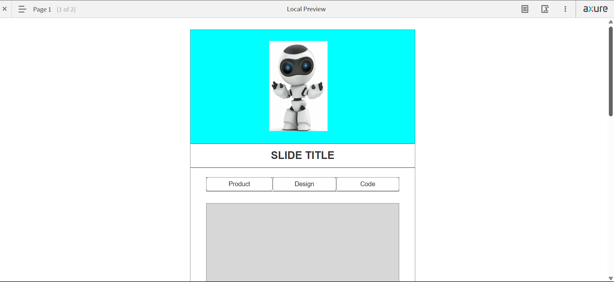
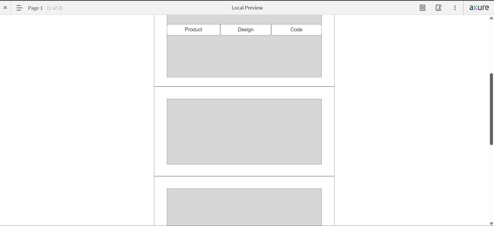
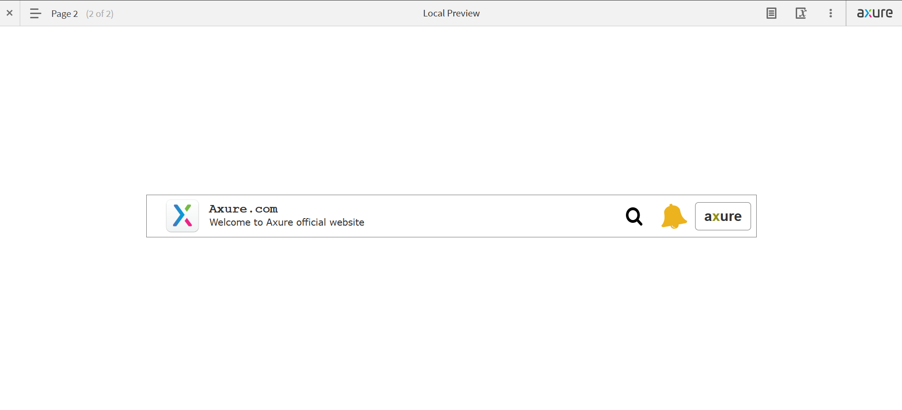

# Day05
This Axure project introduces a custom scrollY option to handle vertical scrolling within a container. By implementing this feature, you can manage the scroll behavior of elements
## output01

This setup creates a realistic, continuous ringing animation for a bell icon by alternating rotations and looping the animation through the fire Loaded event call. It's a smooth and simple way to simulate attention-grabbing UI movement.

